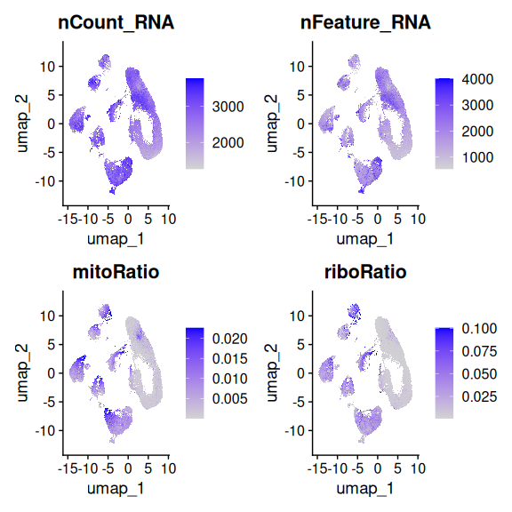
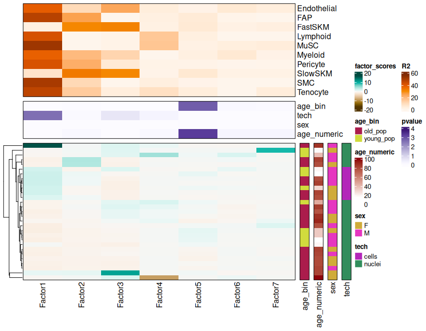
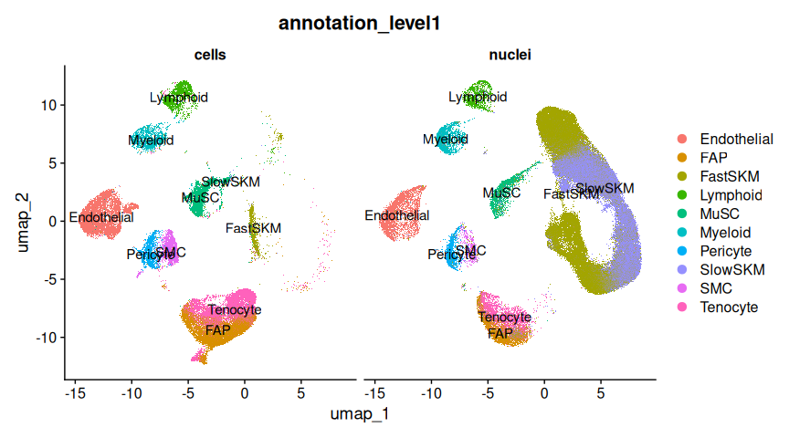
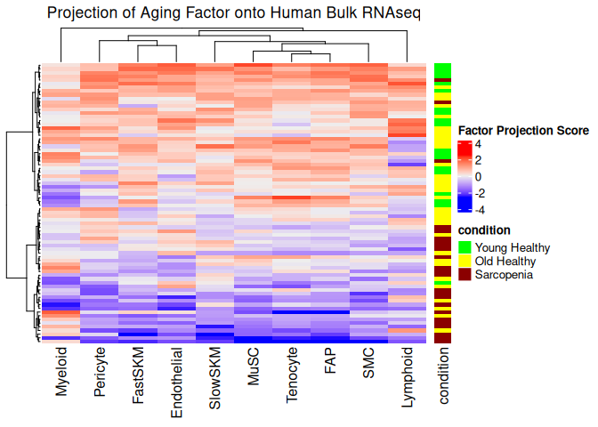
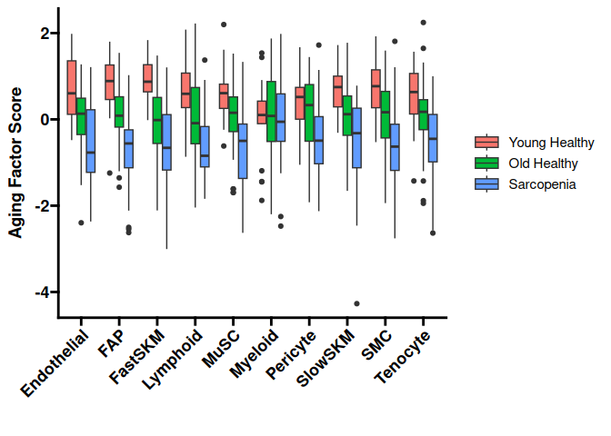

# Introduction

A common method to identify potential therapeutic targets in
transcriptomic data is to use differential expression (DE) to identify
highly differentially expressed genes between two conditions. When it
comes to single-cell/single-nucleus datasets, DE is great at identifying
transcriptomic differences between cell types (a method commonly used to
identify marker genes). ScRNAseq is also very useful for identifying
differences in cell type quantities between samples/conditions. However,
DE is often not ideal for identifying within-cluster,
between-sample/condition transcriptomic changes in scRNAseq datasets
(e.g., what are the transcriptomic differences between muscle
endothelial cells from young and old individuals). This is because batch
effects, noise, variation in the number of cells per sample, and
variation in the number of samples/donors per condition are often quite
large in scRNAseq, leading to in inaccurate results from DE.

Cells can have both cell-type specific and shared responses to the same
cue, and well as feedback loops that occur through cell-cell
interactions and between-organ signals (e.g. hormones). These
multicellular changes are sometimes referred to as “multicellular
programs”. Between-sample DE looks at one cell-type at a time and does
not consider these multicellular programs, which can result in “missing
the forest for the trees”. This is especially true for aging, which
clearly impacts every celltype in the body in numerous ways.

We need more sophisticated methods that are able to extract important
signals from noise and identify both celltype-specific and multicellular
program changes. One such approach is to use Blind Source Separation
techniques, such as PCA, ICA, and NMF. However, when applied directly to
scRNAseq data, these methods will mainly identify differences between
cell types. This limitation can be overcome by taking our genes x cells
matrix, and turn it into a pseudobulk celltype x genes x samples tensor.
We can then decompose the tensor with blind source separation to pull
out the important biological signals.

Here, we analyze single-nucleus RNAseq data from Lai et al. 2024
(<https://doi.org/10.1038/s41586-024-07348-6>) using MOFAcell
(<https://doi.org/10.7554/eLife.93161>) – a factor analysis approach to
single cell data. Ideally, this method will identify a factor that is
highly correlated with age. That “Aging Factor” should then contain a
scored list of how much each gene contributes to aging in each cell
type, independent of technical noise or other biological factors.

# Results

## Dataset overview

This dataset contains muscle biopsies from n = 23 donors. Those donors
were divided into two age groups: a younger population (15-46 years old,
n = 8), and an older population (74-99 years old, n = 15). Of these
donors, 6 were sequenced on both scRNAseq & snRNAseq, 16 were sequenced
on snRNAseq only, and one was sequenced on scRNAseq only.

After alignment, filtering, batch correction, and annotation, the final
dataset consisted of 79649 cells and 212774 nuclei.

<!-- -->

<!-- -->

In order to run our approach effectively, we removed celltypes with a
small number of cells, leaving only the 10 major cell types in the
dataset.

<!-- -->

## Identification of Aging Factor

We construct the data tensor, then decompose it into 7 factors using
MOFAcell. We see that Factor5 is strongly correlated with aging.

<!-- -->

| Factor  | term    |   p.value | adj_pvalue |
|:--------|:--------|----------:|-----------:|
| Factor1 | age_bin | 0.6658006 |  1.0000000 |
| Factor2 | age_bin | 0.1922029 |  0.9610144 |
| Factor3 | age_bin | 0.7356379 |  1.0000000 |
| Factor4 | age_bin | 0.2170664 |  0.9610144 |
| Factor5 | age_bin | 0.0000261 |  0.0001829 |
| Factor6 | age_bin | 0.0435167 |  0.2611003 |
| Factor7 | age_bin | 0.2111064 |  0.9610144 |

This factor is able to separate old from young samples even across
different sample preparation methodologies.

<!-- -->

This is particularly impressive because there are large differences in
celltypes between the two methodologies, so this approach is able to
pull system-wide signals out of complex datasets. Additionally, this
approach is completely unsupervised – at no point was the algorithm
informed of sample classifications.

<!-- -->

Other Factors are strongly correlated with technical batch effects or
artifacts. For example, Factor1 represents the batch effects between
cells and nuceli.

<!-- -->

Factor3 is strongly correlated with the mean counts per cell of each
sample.

<!-- -->

## Analysis of the Aging Factor

Now that we have identified the Aging Factor and shown that it is
independent of technical noise, we will analyze the factor to extract
biological insights.

First, we can investigate how much each celltype contributes to the
Aging Factor. We see that the skeletal muscle cells are the strongest
contributors, followed by Fibro-adipogenic progenitors. This is not
surprising, since the FAPs are known to be regulators of MuSC function
and muscle regeneration, and are known to be perturbed by aging.

<!-- -->

Next, we look at the the gene contributions to the Aging Factor in each
celltype. We see that a large majority of genes only contribute to the
Aging Factor in a few cell types. However, there about 14% of genes
contribute to the Aging Factor in 3 or more celltypes. Further analysis
of these genes could identify high-value targets to reverse age-related
muscle wasting across multiple celltypes (but is not included in this
analysis here).

<!-- -->

Unsurprisingly, we see a strong concordance in celltype contributions
between closely related celltypes (e.g. FastSKM & SlowSKM, or FAPs and
Tenocytes).

<!-- -->

We can input these gene lists into downstream methods, either by taking
the top genes or by using the factor score of each gene for each
celltype similar to a names logfoldchange vector.

For example, we perform pathway enrichment analysis of the Aging Factor.
We see that younger samples are highly enriched in pathways related to
myogenesis and fatty acid metabolism. This is consistent with the
literature, which shows that fatty acid metabolism is disregulated in
muscle during aging; research in mice has demonstrated that restoring
fatty acid metabolism to healthy levels in aged mice restores muscle
mass and strength (<https://doi.org/10.1126/science.abc8059>).

We see that the older samples are enriched in pathways related to
inflammation and DNA damage. This points to targeting inflammaging as a
potential treatment for age-related muscle wasting. In my opinion, this
is likely the most important mechanism to target. A [recent
study](https://doi.org/10.1038/s41586-024-07701-9) found that blocking
the inflammatory cytokine interleukin-11 increased lifespan in both male
and female mice by over 20%, and helped them retain healthy body
composition for longer.

<!-- --><!-- -->

## Projection onto bulk datasets

We can extend that analysis by projecting the Aging Factor onto bulk
RNAseq datasets. Although scRNAseq is great for its ability to
investigate different cell types, its cost often results in a small
number of donors per dataset. This is true for the snRNAseq dataset of
interest, which had N=17 donors. Although this is on the larger end for
a single-cell dataset, N=17 is not enough donors to get strong
correlations between transcriptomic signatures and clinical information.
Bulk RNAseq is much cheaper in comparison, so bulk RNAseq datasets tend
to contain more donors, which enables better correlations with clinical
measurements.

Here, we project the Aging Factor onto a large bulkRNAseq dataset (also
from the Perez et al. manuscript) of muscle aging and
[sarcopenia](https://en.wikipedia.org/wiki/Sarcopenia) (age-related
muscle wasting). We show that the Aging Factor projection is able to
separate donors by condition, and is a better predictor of clinical
measurements of muscle strength than medical diagnosis.

This bulk RNAseq dataset consists of 19 Young Health donors, 33 Old
Healthy donors, and 24 old donors diagnosed with sarcopenia. We then
project the aging factor from the single-cell dataset onto the bulk
RNAseq dataset, and can see that it generally separates the three
clinical groups.

<!-- -->

<!-- -->

<!-- ```{r project_onto_human_oldonly, include = FALSE, message = FALSE, warning = FALSE} -->
<!-- ## redo with only aged for clinical correlations -->
<!-- perez_bulk_meta_old <- perez_bulk_meta[perez_bulk_meta$group != "Young Healthy",] -->
<!-- factor_score_perez_old <- factor_score_perez[rownames(factor_score_perez) %in% perez_bulk_meta_old$sample,] -->
<!-- ## organize for plotting -->
<!-- factor_score_perez_old <- factor_score_perez_old[order(rownames(factor_score_perez_old)), sort(colnames(factor_score_perez_old))] -->
<!-- perez_bulk_meta_old <- perez_bulk_meta_old[order(rownames(perez_bulk_meta_old)), ] -->
<!-- perez_bulk_meta_old$group %<>% as.character() -->
<!-- perez_bulk_meta_old$group %<>% factor(levels = c("Old Healthy", "Sarcopenia")) -->
<!-- ``` -->
<!-- ```{r human_clinical_correlations, fig.width = 12, echo = FALSE, message = FALSE, warning = FALSE} -->
<!-- clin_cor <- data.frame(factor_score = factor_score_perez_old[,5], perez_bulk_meta_old[, c(6, 2:5, 7:9)]) %>%  -->
<!--   rownames_to_column("sample") %>% -->
<!--   reshape2::melt(id.vars = c("factor_score", "sample", "group")) %>% -->
<!--   filter(variable != "walkTest") -->
<!-- ggplot(clin_cor, aes(x = factor_score, y = value)) + -->
<!--   geom_point(aes(color = group)) + -->
<!--   theme_classic() + -->
<!--   facet_wrap(~variable, scale = "free_y") + -->
<!--   stat_poly_line(se = FALSE) + -->
<!--   ylab("Clinical Measurement") + -->
<!--   xlab("Aging Factor Expression") -->
<!-- ``` -->

# Conclusion

Here, we have shown that we can extend factor analysis to scRNAseq data,
and that this technique is a powerful method to extract important
biological signal from technical noise. We additionally show that
utilizing this method on a snRNAseq muscle aging dataset can identify
the biological signature of aging, and that this signature is aligned
with experimental results. Further analysis into the genes of this Aging
Factor can reveal potential therapuetic targets for muscle wasting
diseases like sarcopenia.

The factor extracted from this approach can be used similar to logFC
values and passed to downstream methods, such as drug repuroposing
(<https://doi.org/10.1038/s41467-023-36637-3>) or cell-cell
communication analysis (<https://doi.org/10.1038/s41592-019-0667-5>,
<https://doi.org/10.1101/2023.08.19.553863> ).

Additionally, we can project these factors onto bulk RNAseq data for a
powerful analysis of disease states, and clinical data.
