# Introduction

A common method to identify potential therapeutic targets in transcriptomic data is to use differential expression (DE) to identify highly differentially expressed genes between two conditions. When it comes to single-cell/single-nucleus datasets, DE is great at identifying transcriptomic differences between cell types (a method commonly used to identify marker genes). ScRNAseq is also very useful for identifying differences in cell type quantities between samples/conditions. However, DE is often not ideal for identifying within-cluster, between-sample/condition transcriptomic changes in scRNAseq datasets (e.g., what are the transcriptomic differences between muscle endothelial cells from young and old individuals). This is because batch effects, noise, variation in the number of cells per sample, and variation in the number of samples/donors per condition are often quite large in scRNAseq, leading to in inaccurate results from DE.

Cells can have both cell-type specific and shared responses to the same cue, and well as feedback loops that occur through cell-cell interactions and between-organ signals (e.g. hormones). These multicellular changes are sometimes refered to as "multicellular programs". Between-sample DE looks at one cell-type at a time and does not consider these multicellular programs, which can result in "missing the forest for the trees". This is especially true for aging, which clearly impacts every celltype in the body in numerous ways.

We need more sophisticated methods that are able to extract important signals from noise and identify both celltype-specific and multicellular program changes. One such approach is to use Blind Source Separation techniques, such as PCA, ICA, and NMF. However, when applied directly to scRNAseq data, these methods will mainly identify differences between cell types. This limitation can be overcome by taking our genes x cells matrix, and turn it into a pseudobulk celltype x genes x samples tensor. We can then decompose the tensor with blind source separation to pull out the important biological signals.

Here, we analyze single-nucleus RNAseq data from Perez et al. 2022 (https://doi.org/10.18632/aging.204435) using MOFAcell (https://doi.org/10.7554/eLife.93161) -- a factor analysis approach to single cell data. Ideally, this method will identify a factor that is highly correlated with age. That "Aging Factor" should then contain a scored list of how much each gene contributes to aging in each cell type, independent of technical noise or other biological factors.

# Results

## Dataset overview

This dataset contains n=17 biopsies from the vastus lateralis of 6 younger and 11 older individuals. In the original analysis, they used the CellRanger filtering to identify empty droplets. However, Cellranger tends to be underpowered for single-nucleus data. Furthermore, earlier versions of Cellranger (which were likely used based on the publication date of the manuscript) did a poor job of handling single nucleus data. 

To resolve this, I downloaded the original fastq files from SRA, realigned them with Cellranger v7.1.0, and then used Cellbender to select empty droplets. However, I used the counts from Cellranger, rather than the RNA-decontaminated Cellbender counts, because I suspect that samples from old donors likely have more noise in their transcriptome due to age-related loss of cellular epigenetic information (https://doi.org/10.1016/j.cell.2022.12.027), and I was concerned that ambient RNA removal may accidently remove important biological signal.

After alignment, filtering, batch correction, and annotation, the final dataset consisted of 176,861 cells -- over 30,000 more cells than the original manuscript, even though I used more stringent cell QC filtering than the original manuscript. This also allows us to identify two distinct groups of neural NMJ populations (schwann cells), as well as a distinct group of mast cells, that were not identified in the original manuscript.

### Dataset UMAP {.tabset}

#### Cell types

<!-- -->

#### Age Group

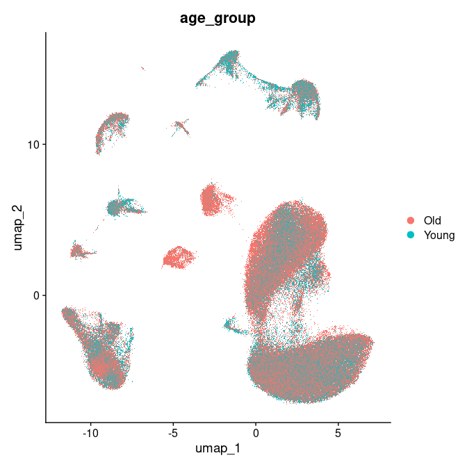<!-- -->

#### Sample

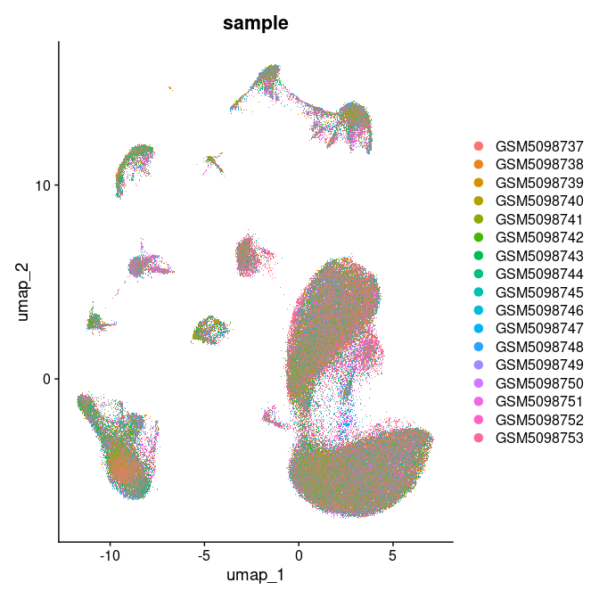<!-- -->

#### Phase

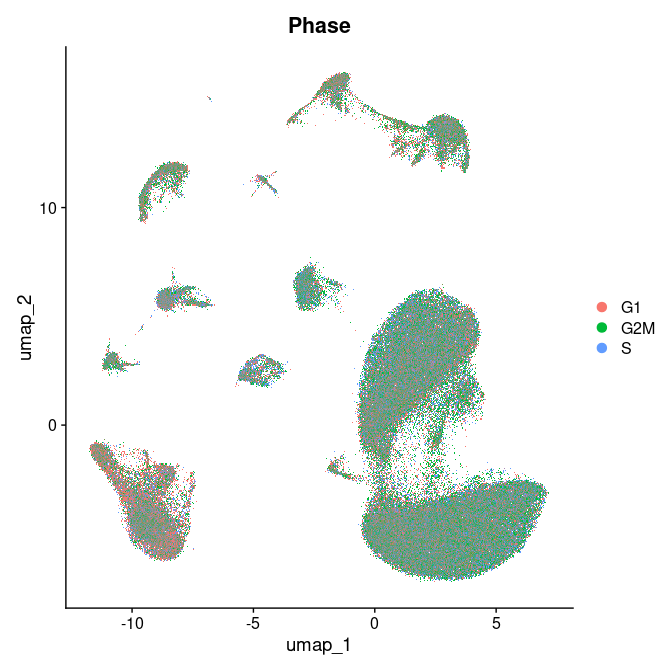<!-- -->

#### QC

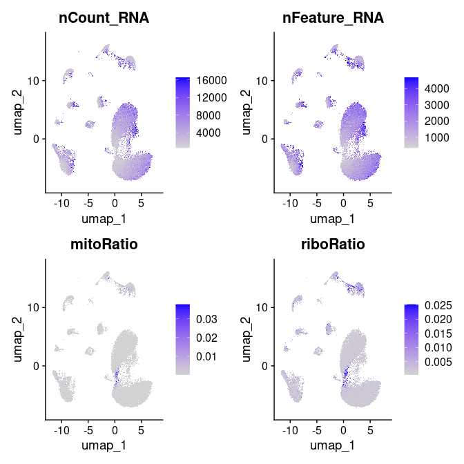<!-- -->

### {-}

## Identification of Aging Factor

We construct the data tensor, then decompose it into 4 factors using MOFAcell. We see that Factor4 is strongly correlated with aging.

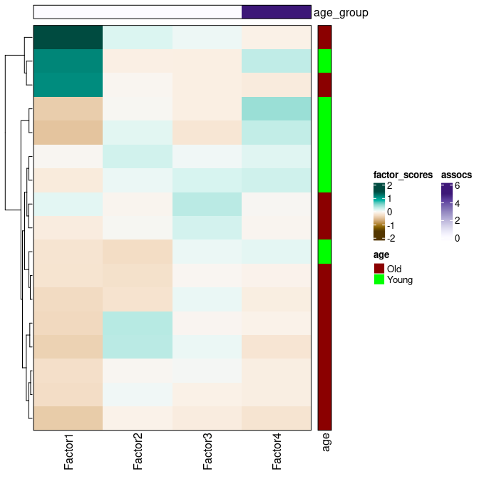<!-- -->

Table: Difference in Factor Score Between Young and Old

|Factor  |term      |   p.value| adj_pvalue|
|:-------|:---------|---------:|----------:|
|Factor1 |age_group | 0.8587895|    1.0e+00|
|Factor2 |age_group | 0.8431689|    1.0e+00|
|Factor3 |age_group | 0.4353539|    1.0e+00|
|Factor4 |age_group | 0.0000018|    7.1e-06|

However, we also notice that Factor1 is strongly expressed in several samples (to the point where it messes up the color scaling on our heatmap), and is not associated with aging. Further investigation into the expression pattern of Factor 1 reveals that it is strongly correlated with poor sample quality. This is a good result, as it shows that our approach is able to separate technical noise from meaningful biological signals 

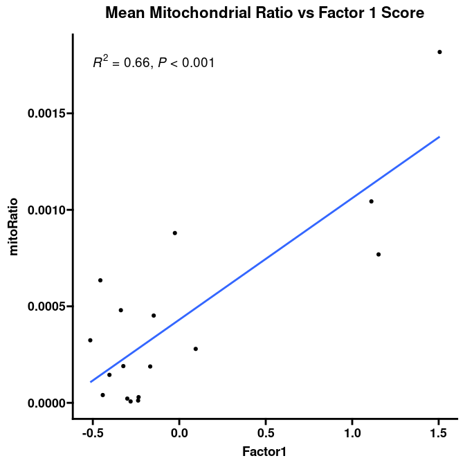<!-- -->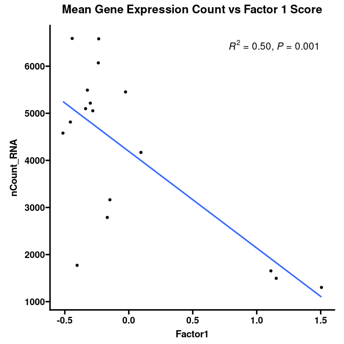<!-- -->

When we remove Factor1 from our heatmap, we see a nice separation of young and old samples.

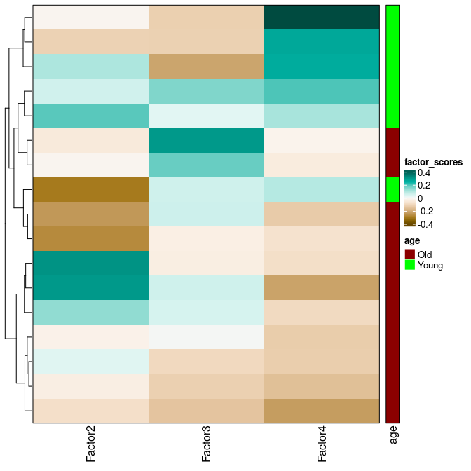<!-- -->

In fact, Factor4 perfectly separates young from old donors. At no point was the algorithm ever informed of the donor groupings, so this result shows that our approach can extract meaningful biological signals in an unsupervised manner.

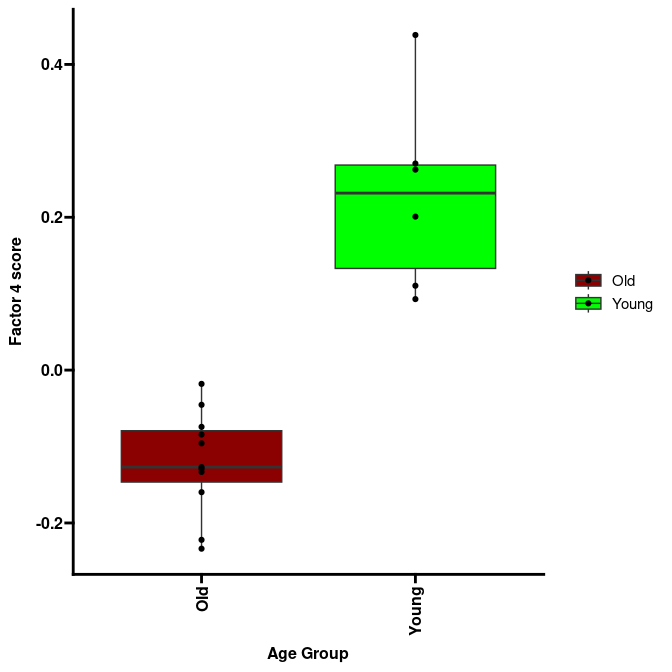<!-- -->

## Analysis of the Aging Factor

Now that we have identified the Aging Factor and shown that it is independent of technical noise, we will analyze the factor to extract biological insights. First, we can investigate how much each celltype contributes to the Aging Factor. We see that the skeletal muscle cells are the strongest contributors, followed by the schwann cells. This is not surprising, since loss of neurotransmission to muscle cells is a major contributor to muscle wasting (in fact, crushing the motor neurons innervating a muscle is a common method to create mouse models of muscle wasting).

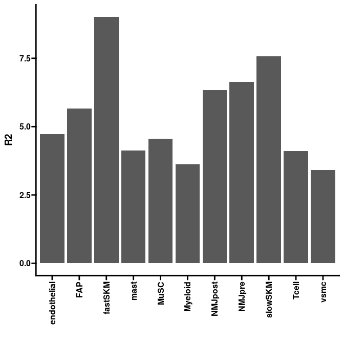<!-- -->

Next, we look at the the gene contributions to the Aging Factor in each celltype. We see that a large majority of genes only contribute to the Aging Factor in a few cell types. However, there about 14% of genes contribute to the Aging Factor in more than 3 celltypes. Further analysis of these genes could identify high-value targets to reverse age-related muscle wasting (but is not included in this analysis here).

<!-- -->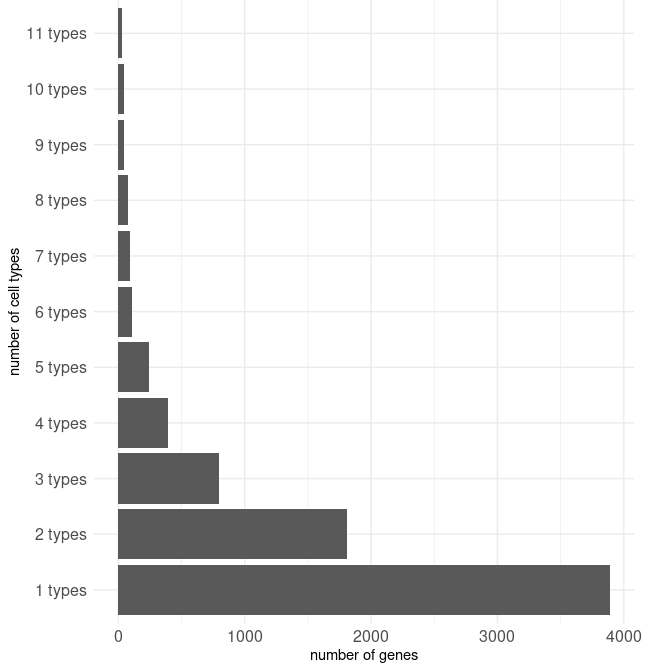<!-- -->

Next, we perform pathway enrichment analysis of the Aging Factor. We see that younger samples are highly enriched in myogenesis, whereas older samples are highly enriched in fatty acid metabolism and adipogenesis pathways. This is consistent with the literature, which shows that muscle tissue is replaced with fatty tissue during aging. Furthermore, other research in mice has demonstrated that restoring fatty acid metabolism to healthy levels in aged mice restores muscle mass and strength (https://doi.org/10.1126/science.abc8059)

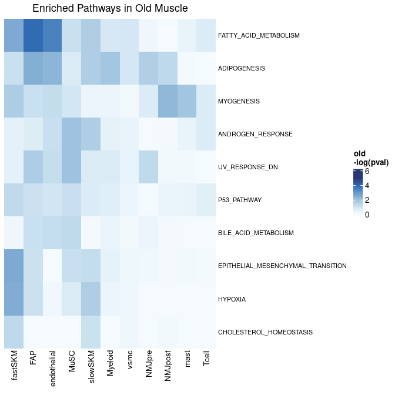<!-- --><!-- -->

# Conclusion

Here, we have shown that we can extend factor analysis to scRNAseq data, and that this technique is a powerful method to extract important biological signal from technical noise. We additionally show that utilizing this method on a snRNAseq muscle aging dataset can identify the biological signature of aging, and that this signature is aligned with experimental results. Further analysis into the genes of this Aging Factor can reveal potential therapuetic targets for muscle wasting diseases like sarcopenia.

The factor extracted from this approach can be used similar to logFC values and passed to downstream methods, such as drug repuroposing (https://doi.org/10.1038/s41467-023-36637-3) or cell-cell communication analysis (https://doi.org/10.1038/s41592-019-0667-5, https://doi.org/10.1101/2023.08.19.553863 ). 

Additionally, we can project these factors onto bulk RNAseq data for a powerful analysis of animal models, disease states, and clinical data. This approach will also be explored in this repository.

