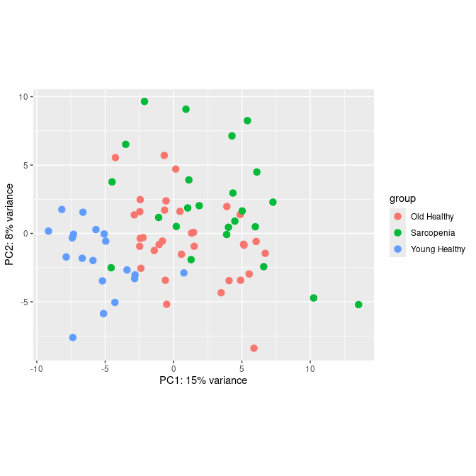
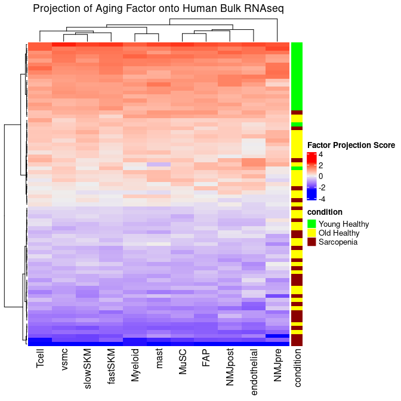
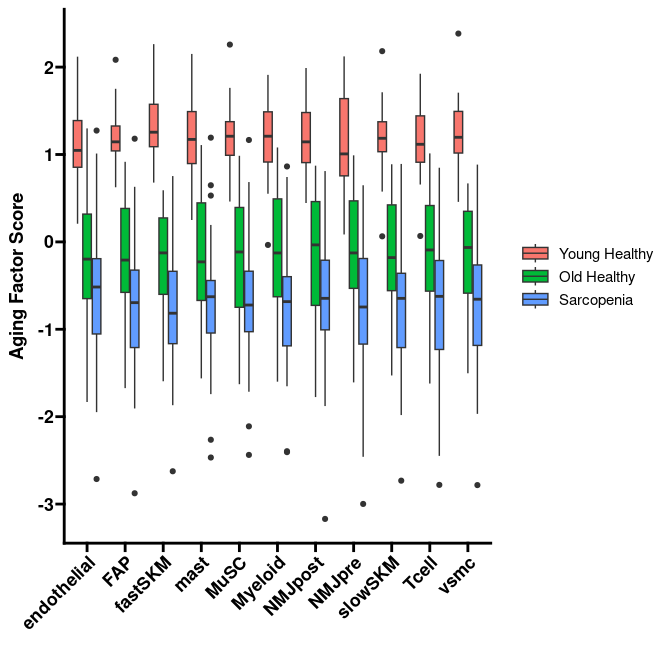
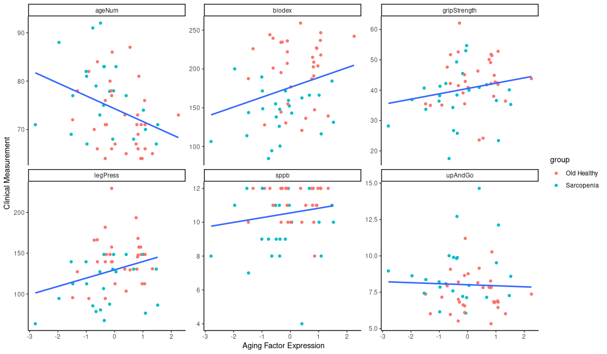
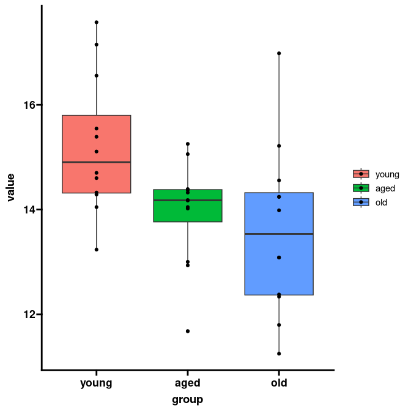
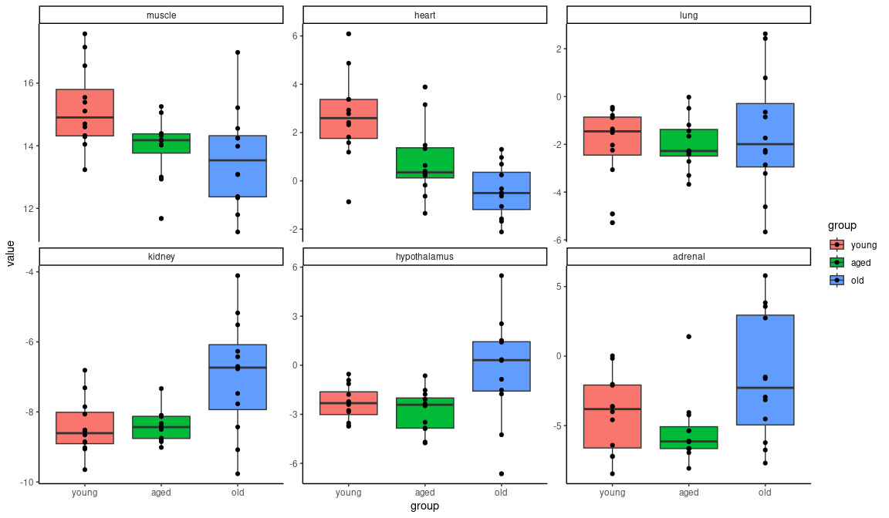

# Introduction

In our [previous analysis](https://github.com/spginebaugh/muscle_aging_ML/blob/main/scripts/analysis/MOFA_results_plotting_and_enrichment.md), we used factor analysis to extract the Aging Factor from a [single-nucleus RNAseq dataset](https://doi.org/10.18632/aging.204435) of muscle tissue from young and old donors.

We can extend that analysis by projecting the Aging Factor onto bulk RNAseq datasets. Although scRNAseq is great for its ability to investigate different cell types, its cost often results in a small number of donors per dataset. This is true for the snRNAseq dataset of interest, which had N=17 donors. Although this is on the larger end for a single-cell dataset, N=17 is not enough donors to get strong correlations between transcriptomic signatures and clinical information. Bulk RNAseq is much cheaper in comparison, so bulk RNAseq datasets tend to contain more donors, which enables better correlations with clinical measurements. 

Here, we project the Aging Factor onto a large bulkRNAseq dataset (also from the Perez et al. manuscript) of muscle aging and [sarcopenia](https://en.wikipedia.org/wiki/Sarcopenia) (age-related muscle wasting). We show that the Aging Factor projection is able to separate donors by condition, and is a better predictor of clinical measurements of muscle strength than medical diagnosis.

Additionally, we project the Aging Factor across species onto a [mouse bulkRNAseq dataset](https://doi.org/10.1016/j.celrep.2022.111982). We find that we are able to project across species, suggesting that our Aging Factor is conserved across mammalian evolution (or, at least conserved between mice and humans). 

# Results

## Projection of Aging Factor onto Human Sarcopenia Data

We first utilize a bulk RNAseq dataset consisting of 19 Young Health donors, 33 Old Healthy donors, and 24 old donors diagnosed with sarcopenia. We can see from the PCA of this dataset that this is already noticeable separation between the three patient groups.

<!-- -->

We then project the aging factor, and can see that it almost-perfectly separates the Young Healthy donors from the Old Healthy and Sarcopenia donors. We also see that it generally separates the Old Healthy donors from the Sarcopenia donors.

<!-- -->

We separate this data by both cell type and donor condition. We can see that the projection from some cell types, like fast skeletal muscle, appear to separate Old Healthy donors from Sarcopenia donors better than other cell types, like endothelial cells. This may suggest that age-related transcriptomics changes in fast skeletal muscle are more important to the development of sarcopenia than age-related changes in endothelial cells. However, this approach needs more validation, and may benefit from restricting the projection to only cell-type specific Aging Factor genes. 

<!-- -->

Next, we can investigate how well our aging factor correlated with various clinical data from the donors. For improved clarity, we restrict this analysis to only Old Healthy and Sarcopenia donors.

<!-- -->
We find that the Aging Factor Expression of each donor is a better predictor of grip strength and leg press than diagnosis or age. Thus, we can use factor projection as an accurate predictor of clinical outcomes. Importantly, this analysis also reveals that sarcopenia is largely "advanced aging" -- essentially, a stronger expression of the natural degenerative changes that occur during the aging process.

## Projection of Aging Factor onto Mouse Aging Data

Next, we tested the ability to project our Aging Factor across species. We used a [dataset](https://doi.org/10.1016/j.celrep.2022.111982) of samples from young, aged, and old mice, across 6 different tissues. We first examined the ability of factor projection to separate the different age groups in the muscle tissue, and see that it is relatively capable of separating the age groups.

<!-- -->

We next investigate the capabilities of factor projection across different tissues. We see that it is able to separate age groups in muscle and heart, but not in other organs. This is a positive outcome, as it demonstrates that our Aging Factor is specific to muscle aging.

<!-- -->
Based on these results, I hypothesize that this projection of factors can be utilized to quantify how accurately a mouse model system recapitulates human disease.

